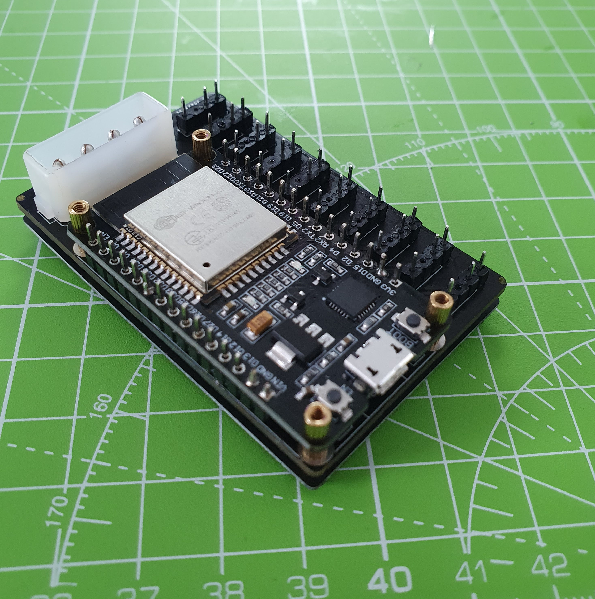
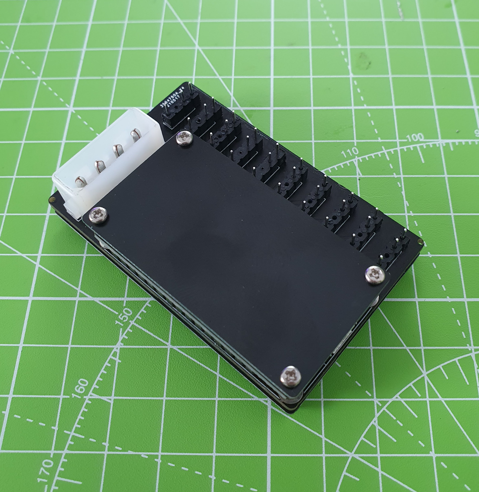
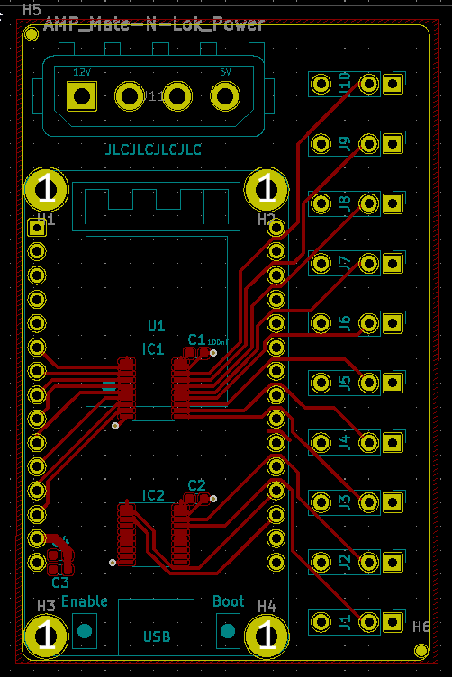
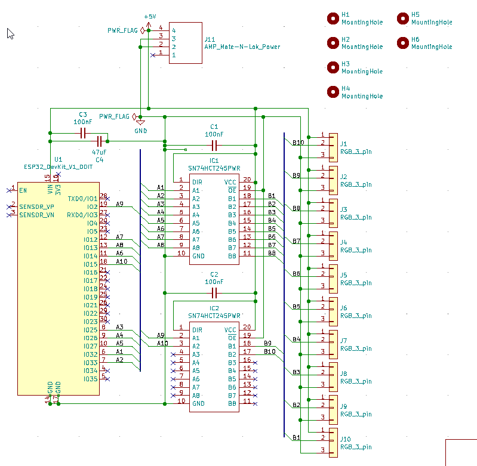

# RGB-controller
A 10-channel RGB controller based on the ESP32 microcontroller

# Ordering the PCB
To order the PCB at [JLCPCB](https://jlcpcb.com) you will need to do the following steps:

1. Submit `/gerber.zip` as your job
2. Choose the following options:
    1. PCB Color: Black
    2. Remove Order Number: Specify a location
3. Enable SMT Assembly and choose:
    1. Top side
    2. SMT QTY: 2
    3. Tooling holes: Added by Customer
4. Confirm
5. Upload files:
    1. BOM File: `/JLC/Controller.csv`
    2. CPL File: `/JLC/Controller-top-pos.csv`
6. Click through to the end
7. To order the top and bottom plates (high recommended), make two more orders with `plates/gerber-top.zip` and `plates/gerber-bottom.zip` - no SMT Assembly required
    1. PCB Thickness: Can be as low as 1.0mm but I recommend leaving it at 1.6mm
    2. Remove Order Number: Not necessary, I recommend No, but you could choose Yes

** **MAKE SURE YOU CHOOSE THE CHEAPEST SHIPPING OPTION!!** **.

Final discounts will be applied right before you pay, including free SMT Assembly. The final cost should be around $30 but it varies.

## Components

Component | Quantity | Link
-|-|-
ESP32 Devkit v1 (DOIT) | 1 | https://www.aliexpress.com/item/1005001648850998.html
4-pin RGB needle adapter | 10 | https://www.aliexpress.com/item/32948400198.html
350211-1 Mate-N-Lok connector | 1 | Find these locally - search "350211-1" at your local electronics store, or check Ebay sellers in your area. You may know this better as a "Molex connector".
M2 standoff, 4mm, male-female | 12 or 20 | https://www.aliexpress.com/item/1005002542327479.html?spm=a2g0o.productlist.0.0.9c1c7ed6qyouL8&aem_p4p_detail=202106131120581657595816822930013487928 or locally. Order 20 if not using screws (see next).
Optional: M2 screws and nuts | 4 | You can also find these on Aliexpress, or with the above spacers in kits on Amazon, etc. To keep costs down you can use use 20 male-female standoffs, but screws + nuts (or 4x female-female standoffs) will be neater.

## Build
Soldering and construction order order I would recommend:

### 1. RGB headers
10x RGB pin headers should come first.
You will need to remove or clip one pin from each header.
To pull them out I recommend using pliers to push the pins through.
You can also grab the pin with pliers and use your iron to heat it from the other side, this will free it from the plastic.

Preparing these pin headers is by far the most time consuming part of the assembly.

**Protip**: Place all 10 pin headers on your PCB, then place one of your spare PCBs over the top.
You might want to line up the pin headers on one side, and then wiggle the binding ones until they enter the mounting holes.
This will help you to get 10x headers which are nicely lined up and evenly spaced.

### 2. PCB standoffs
Most standoffs do not pass through the holes on the ESP32 devkit, so they will need adding to the PCB before the ESP32 devkit is soldered on top.

### 3. ESP32 devkit
Next, solder this to the board using the included pin headers. You might optionally want to use the standoffs to fix it to the PCB while soldering. You will also need to clip the headers after it is soldered.

### 4. 350211-1 Mate-N-Lok connector ("Molex connector")
Finally you can solder the power connector, make sure to use plenty of solder on this one.

### 5. Screw it all together
Screw on your top and bottom plates. These will be important in protecting your RGB controller and preventing shorts.

## Loading the firmware
The final step is to load the firmware in accordance with instructions on the WLED wiki: https://github.com/Aircoookie/WLED/wiki
