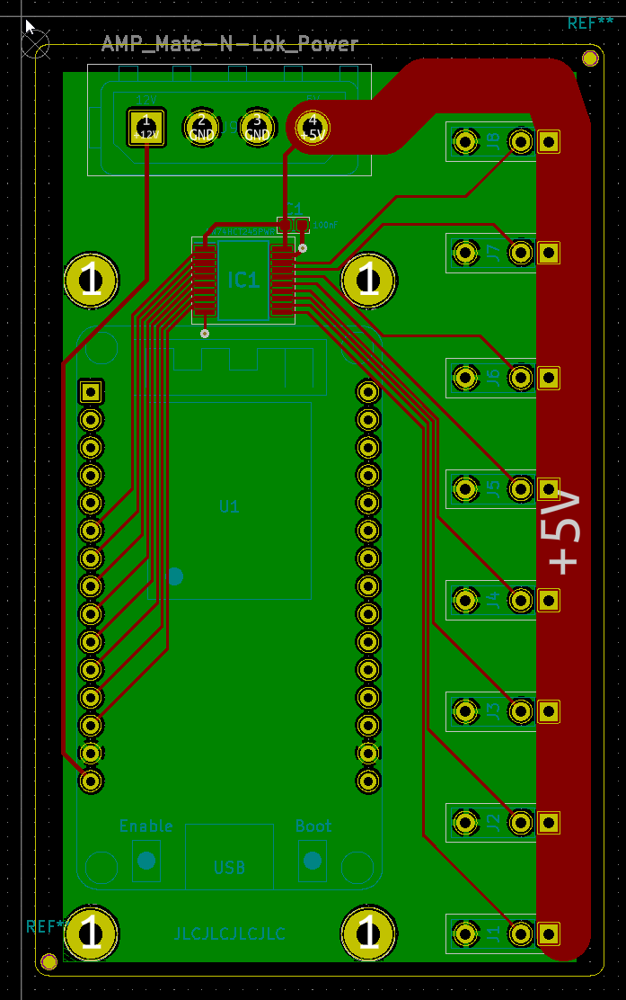

# RGB-controller
An 8-channel RGB controller based on the ESP32 microcontroller

## Components

Component | Quantity | Link
-|-|-
ESP32 Devkit v1 (DOIT) | 1 | https://www.aliexpress.com/item/1005001648850998.html
4-pin RGB needle adapter | 10 | https://www.aliexpress.com/item/32948400198.html
350211-1 Mate-N-Lok connector | 1 | Find these locally - search "350211-1" at your local electronics store, or check Ebay sellers in your area
